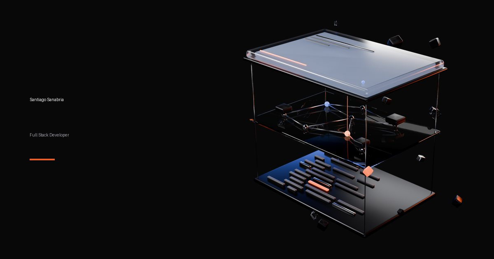

# Santiago Sanabria — Portfolio

Portfolio profesional one-page de **Santiago Sanabria**, desarrollador Full Stack en Bucaramanga, Colombia.
Estética oscura, técnica y cinematográfica, con los elementos 3D principales **modelados, iluminados y
renderizados en Blender mediante scripts reproducibles**.

**Sitio publicado:** https://santiagosanabria-1.github.io/portafolio-completo/



---

## Contenido

- [Decisiones técnicas](#decisiones-técnicas)
- [Estructura](#estructura)
- [Pipeline 3D con Blender](#pipeline-3d-con-blender)
- [Optimización de imágenes](#optimización-de-imágenes)
- [Ejecutar en local](#ejecutar-en-local)
- [Accesibilidad](#accesibilidad)
- [Performance](#performance)
- [Git Flow](#git-flow)
- [Despliegue](#despliegue)
- [Auditoría final](#auditoría-final)
- [Honestidad del contenido](#honestidad-del-contenido)

---

## Decisiones técnicas

| Decisión | Motivo |
|---|---|
| **HTML + CSS + JavaScript sin framework ni build** | Es una sola página de contenido, sin estado de aplicación. Las piezas pesadas (3D) llegan pre-renderizadas, así que un framework solo añadiría JavaScript. GitHub Pages sirve los archivos tal cual. |
| **Blender → render optimizado → web**, no WebGL | El 3D aporta atmósfera y narrativa, no interacción. Un render WebP de ~80–230 KB carga más rápido y funciona igual en cualquier dispositivo que una escena WebGL de varios MB. El movimiento se simula con parallax y flotación en CSS/JS ligero. |
| **Sin dependencias en runtime** | Cero librerías JS. Las animaciones usan solo `transform` y `opacity`. La única petición externa son las fuentes (Geist / Geist Mono, Google Fonts). |
| **Español** (`lang="es"`) | Idioma de todo el contenido; los `id` de las anclas se mantienen en inglés (`#home`, `#about`, `#skills`, `#projects`, `#contact`). |

### Sistema visual

| Token | Valor | Uso |
|---|---|---|
| `--color-bg` | `#080808` | Fondo |
| `--color-surface` / `--color-surface-2` | `#111111` / `#181818` | Superficies |
| `--color-text` | `#F5F5F5` | Texto principal |
| `--color-muted` | `#A1A1AA` | Texto secundario |
| `--color-accent` | `#EA5C25` | Acento: botones, líneas, índices, iluminación 3D (uso moderado) |
| `--color-accent-2` | `#384A90` | Acento secundario: iluminación y detalles 3D, glows |

Tipografía: **Geist** (texto) y **Geist Mono** (metadatos técnicos). Curvas de movimiento:
`cubic-bezier(0.23, 1, 0.32, 1)` (entradas) y `cubic-bezier(0.77, 0, 0.175, 1)` (movimiento en pantalla).

## Estructura

```
.
├── index.html                 # One page semántica (header, main > sections, footer)
├── css/styles.css             # Tokens → base → layout → componentes → secciones → motion
├── js/main.js                 # Navegación, sección activa, reveal, parallax, timeline
├── assets/
│   ├── img/                   # WebP responsivos generados (no editar a mano)
│   ├── icons/                 # favicon.svg + PNG de respaldo
│   └── src/projects/          # Capturas originales de los proyectos
├── blender/
│   ├── scripts/               # common.py + hero.py, workspace.py, contact.py
│   ├── scenes/                # .blend generados por los scripts
│   ├── renders/               # Masters WebP (los PNG crudos no se versionan)
│   └── assets/
└── tools/
    ├── optimize_images.py     # Renders/capturas → WebP responsivos + imagen Open Graph
    └── build_icons.py         # favicon.svg → PNG 32px y apple-touch-icon
```

Secciones: **Header · Hero · About · Skills · Projects · Process · Contact · Footer**.

## Pipeline 3D con Blender

Tres escenas, generadas 100% por código (sin modelos descargados), con semillas aleatorias fijas para que
cada render sea reproducible:

| Escena | Concepto | Uso en la página |
|---|---|---|
| `hero.py` | **CODE → SYSTEM → PRODUCT**: vista explosionada de una pila de tres capas. Placa de grafito con barras que representan código, placa de vidrio con red de nodos y módulos, bloque de vidrio esmerilado retroiluminado. Piezas que se desprenden de la capa de código. | Protagonista del Hero, fondo transparente, flota sobre la página. |
| `workspace.py` | *Digital workspace* abstracto: pantalla principal, paneles flotantes a distintas profundidades, módulos, nodos y conexiones. El código se representa solo con barras de luz. | Atmósfera detrás del encabezado de Proyectos. |
| `contact.py` | **BUILD → SHIP → CONNECT**: un monolito de vidrio y grafito que se descompone en módulos que viajan, se alinean y terminan en un único nodo naranja. | Cierre visual de Contacto. |

Materiales: vidrio (transmisión + coat), metal grafito anisotrópico, acero, emisivos naranja/azul.
Render: **Cycles** (GPU OptiX/CUDA con fallback a CPU), denoiser OpenImageDenoise, AgX, profundidad de
campo sutil, cámara 3/4, película transparente con *transparent glass*.

```bash
# Blender 5.2 LTS
"C:\Program Files\Blender Foundation\Blender 5.2\blender.exe" -b --factory-startup --python blender/scripts/hero.py
"C:\Program Files\Blender Foundation\Blender 5.2\blender.exe" -b --factory-startup --python blender/scripts/workspace.py
"C:\Program Files\Blender Foundation\Blender 5.2\blender.exe" -b --factory-startup --python blender/scripts/contact.py
```

Con `PREVIEW=1` cada script hace un render rápido de baja resolución para iterar.

## Optimización de imágenes

```bash
pip install pillow
python tools/optimize_images.py
python tools/build_icons.py
```

- Recorta los márgenes transparentes de los renders.
- Genera variantes WebP por ancho (`srcset` + `sizes`), p. ej. `hero-720/1100/1500.webp`.
- Aplana los renders de fondo sobre `#080808` (sin canal alfa → archivos mucho más ligeros).
- Construye `og-image.jpg` (1200×630) para redes sociales.

| Asset | Peso |
|---|---|
| Hero (720 / 1100 / 1500 px) | 78 / 143 / 229 KB |
| Workspace (768 / 1280 / 1920 px) | 6 / 11 / 19 KB |
| Contacto (720 / 1100 / 1600 px) | 22 / 38 / 62 KB |
| Capturas de proyectos (720 / 1200 px) | 10–48 KB |

## Ejecutar en local

No hay build. Cualquier servidor estático sirve:

```bash
python -m http.server 5500
# abrir http://localhost:5500
```

## Accesibilidad

- HTML semántico: `header`, `nav`, `main`, `section` con `aria-labelledby`, `article`, `figure`, `dl`,
  jerarquía `h1 → h2 → h3 → h4` sin saltos.
- *Skip link*, foco visible (`:focus-visible` naranja), objetivos táctiles ≥ 44 px.
- Menú móvil con `aria-expanded`/`aria-controls`, cierre con `Esc`, fondo `inert` mientras está abierto y
  devolución del foco al botón.
- `alt` descriptivo en todas las imágenes de contenido; las decorativas usan `alt=""`/`aria-hidden`.
  El diagrama de arquitectura es un SVG con `role="img"`, `<title>` y `<desc>`.
- `prefers-reduced-motion`: sin flotación, sin parallax, sin desplazamientos; el scroll suave se desactiva.
- Contraste verificado (WCAG AA): texto secundario 7.8:1, texto sobre botón naranja 5.7:1.

## Performance

- Imagen del Hero **sin lazy-load** y con `fetchpriority="high"` (es el LCP); el resto con
  `loading="lazy"` y `decoding="async"`, siempre con `width`/`height` para evitar *layout shift*.
- Un único bucle `requestAnimationFrame` que solo corre mientras hay algo que animar.
- Animaciones solo con `transform`/`opacity`; hover gateado con `(hover: hover) and (pointer: fine)`.
- CSS y JS sin dependencias; fuentes con `display=swap` y `preconnect`.

## Git Flow

- `main`: versión publicada.
- `develop`: integración.
- Ramas de trabajo: `feature/3d-assets`, `feature/hero`, `feature/projects`, `fix/html-validation`,
  `feature/deployment`, integradas con `--no-ff`.
- Commits con [Conventional Commits](https://www.conventionalcommits.org/) + gitmoji
  (`feat(3d)`, `perf`, `style`, `refactor`, `chore`…).

## Despliegue

GitHub Pages, servido desde la rama `gh-pages`, que el workflow
`.github/workflows/pages.yml` sincroniza automáticamente con `main` en cada push.
Todas las rutas son relativas, así que la página funciona bajo el subpath `/portafolio-completo/`.
Rollback: revertir el commit en `main` y el workflow republica la versión anterior.

## Auditoría final

| Área | Resultado |
|---|---|
| Responsive | Revisado en 320, 375, 390, 430, 768, 1024, 1280, 1440 y 1920 px, sin overflow horizontal. |
| HTML | `html-validate`: 0 problemas. |
| Accesibilidad | `axe-core` (WCAG 2.1 A/AA + best practices) en desktop y móvil: 0 violaciones. |
| Navegación | Anclas, menú móvil, teclado, `Esc`, foco y sección activa probados con Playwright. |
| Motion | `prefers-reduced-motion` verificado: sin animaciones de desplazamiento. |
| Assets | Todas las rutas relativas existen; sin imágenes rotas. |

## Honestidad del contenido

Toda la información sale de fuentes verificables: el perfil y la hoja de vida públicos en GitHub y el código de
cada proyecto. Las cifras (126 pruebas automatizadas, 3 proveedores de LLM, 20 repositorios públicos) se
contaron sobre los repositorios. Los proyectos privados o en desarrollo están marcados como tales, y solo se
enlazan repositorios y demos que existen.

---

© Santiago Sanabria. Diseño, código y assets 3D propios.
